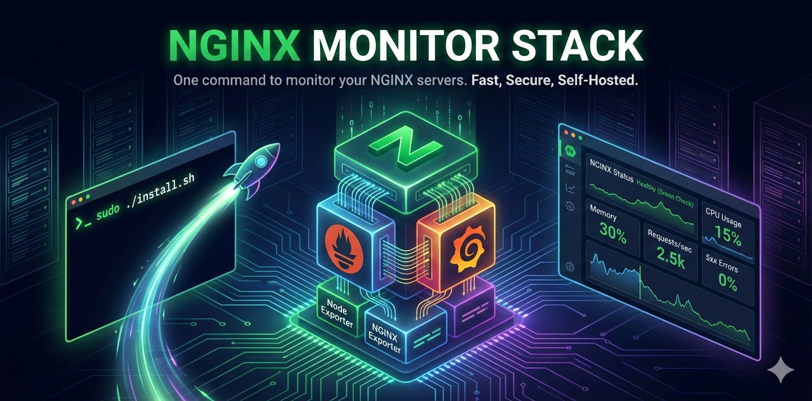

<p align="center">
  
</p>

# 📊 NGINX Monitor Stack

> **One command to monitor your NGINX servers.** No complex setup. No cloud dependencies. Just run and go.

[](LICENSE)
[](CONTRIBUTING.md)

Stop wasting hours configuring Prometheus, Grafana, and exporters separately. NGINX Monitor Stack installs and configures everything in under 3 minutes.

```bash
sudo ./install.sh
```

That's it. You now have:
- ✅ Real-time NGINX metrics
- ✅ System monitoring (CPU, RAM, disk, network)
- ✅ Beautiful pre-built dashboards
- ✅ Alerts for common issues
- ✅ Zero external dependencies

---

## 🚀 Quick Start

```bash
# Clone the repo
git clone https://github.com/alexgarbacea/nginx-monitor
cd nginx-monitor

# Run the installer
sudo ./install.sh
```

**After installation:**
- Grafana: `http://127.0.0.1:3000`
- Prometheus: `http://127.0.0.1:9090`

---

## 🎯 Why NGINX Monitor Stack?

| The Old Way | With NGINX Monitor Stack |
|-------------|--------------------------|
| Install Prometheus manually | ✅ One command |
| Configure scrape targets | ✅ Auto-configured |
| Set up node_exporter | ✅ Included |
| Set up nginx-exporter | ✅ Included |
| Install Grafana | ✅ Included |
| Find and import dashboards | ✅ Pre-installed |
| Configure data sources | ✅ Auto-configured |
| Set up alerts | ✅ Pre-configured |
| **Time: 2-4 hours** | **Time: 3 minutes** |

---

## 🔧 What Gets Installed

| Component | Purpose | Port |
|-----------|---------|------|
| **Prometheus** | Metrics database | 9090 |
| **Grafana** | Dashboards & visualization | 3000 |
| **Node Exporter** | System metrics (CPU, RAM, disk) | 9100 |
| **NGINX Exporter** | NGINX metrics | 9113 |

All services bind to `localhost` only — nothing is exposed to the internet.

---

## 💻 Supported Systems

- ✅ Ubuntu 20.04, 22.04, 24.04
- ✅ Debian 11, 12
- ✅ CentOS 8, 9
- ✅ RHEL 8, 9
- ✅ Rocky Linux 8, 9
- ✅ AlmaLinux 8, 9
- ✅ Amazon Linux 2, 2023

**Requirements:**
- 512 MB RAM (1 GB recommended)
- 2 GB disk space
- x86_64 or ARM64 architecture

---

## 🌐 Remote Access

Services bind to localhost for security. Access remotely via SSH tunnel:

```bash
# From your local machine
ssh -L 3000:127.0.0.1:3000 user@your-server

# Then open in browser
http://localhost:3000
```

---

## 📋 Commands

```bash
# Install everything
sudo ./install.sh

# Check status
sudo ./status.sh

# Uninstall (keeps data)
sudo ./uninstall.sh

# Uninstall and remove all data
sudo ./uninstall.sh --remove-data
```

**Installation options:**
```bash
sudo ./install.sh --skip-nginx    # Skip NGINX exporter
sudo ./install.sh --skip-grafana  # Prometheus only
sudo ./install.sh --debug         # Verbose output
```

---

## 🔐 Security First

Security isn't an afterthought — it's the foundation:

- 🔒 **Localhost binding** — No ports exposed to the internet
- 🔒 **Non-root services** — Each service runs as its own user
- 🔒 **Random passwords** — Grafana admin password auto-generated
- 🔒 **Systemd hardening** — ProtectSystem, NoNewPrivileges, PrivateTmp
- 🔒 **Checksum verification** — All downloads verified before installation

See [SECURITY.md](SECURITY.md) for full details.

---

## ⚠️ Pre-configured Alerts

Out of the box, you get alerts for:

| Alert | Trigger |
|-------|---------|
| NGINX Down | NGINX stops responding |
| High Error Rate | 5xx errors > 5% |
| High CPU | CPU usage > 80% for 10 min |
| Low Disk Space | < 10% free |
| High Memory | Memory usage > 90% |

---

## 🔑 Default Credentials

- **Username:** `admin`
- **Password:** Randomly generated (shown after install)

Password stored in: `/etc/nginx-monitor/secrets/grafana_admin_password`

⚠️ **Change the password after first login!**

---

## 📁 File Locations

```
/opt/nginx-monitor/          # Binaries
/etc/nginx-monitor/          # Configuration
/var/lib/nginx-monitor/      # Data (Prometheus, Grafana)
/var/log/nginx-monitor/      # Logs
```

---

## 🔄 Updating

```bash
git pull
sudo ./install.sh
```

The installer detects existing installations and upgrades them.

---

## 🐛 Troubleshooting

**Service won't start?**
```bash
sudo journalctl -u prometheus -n 50
sudo journalctl -u grafana-server -n 50
```

**NGINX metrics missing?**
```bash
curl http://127.0.0.1:8080/nginx_status
```

**Port conflicts?**
```bash
ss -tuln | grep -E ':(9090|3000|9100|9113|8080)'
```

---

## 📄 License

MIT License — use it however you want.

---

## 🙏 Credits

Built on top of these amazing open-source projects:
- [Prometheus](https://prometheus.io/)
- [Grafana](https://grafana.com/)
- [node_exporter](https://github.com/prometheus/node_exporter)
- [nginx-prometheus-exporter](https://github.com/nginxinc/nginx-prometheus-exporter)

---

## FAQ

### Why not use Docker or Docker Compose?
Docker is great, but it adds another layer of abstraction, dependencies, and operational overhead. This project is designed for bare-metal and VM users who want native systemd services, minimal moving parts, and predictable performance. No Docker daemon, no container networking quirks, no volume permission headaches.

### Can I still use this if I already run Docker on the server?
Yes. This stack runs directly on the host and binds only to localhost, so it won’t interfere with Docker workloads. It’s a good fit if you want host-level visibility alongside containerized apps.

### Why not use a managed or cloud monitoring service?
Because not everyone wants to ship metrics off-server or pay per-node pricing. This stack is fully self-hosted, works offline, has zero vendor lock-in, and keeps all data on your machine.

### Is this meant for production use?
Yes — especially for small to medium setups. It uses the same Prometheus, Grafana, and exporters people run in production, just pre-wired and hardened. For very large or multi-cluster environments, a centralized Prometheus or long-term storage layer may be more appropriate.

### How is this different from setting it up manually?
Manual setups are flexible but time-consuming and error-prone. This stack trades some configurability for speed, sane defaults, and consistency. You can still customize everything after install — you just don’t have to start from zero.

### Does this replace my existing Prometheus or Grafana?
No. It’s intended as a self-contained monitoring stack. If you already have Prometheus or Grafana running on the same machine, you will likely hit port conflicts. In that case, either use this on a dedicated node or integrate exporters into your existing setup.

### Can I add more exporters or dashboards?
Yes. This is a standard Prometheus and Grafana installation under the hood. You can add exporters, dashboards, alerts, or scrape targets just like you would in any other setup.

### What happens if I uninstall it?
Uninstalling stops and removes the services. By default, data is preserved so you can reinstall without losing metrics or dashboards. If you want a full cleanup, use the `--remove-data` flag.

### Is this secure enough for internet-facing servers?
Yes. All services bind to 127.0.0.1, run as non-root users, and use systemd hardening. Remote access is expected to be done via SSH tunneling rather than exposed ports.

---

<p align="center">
  <b>⭐ Star this repo if it saved you time!</b><br>
  Built with ❤️
</p>
